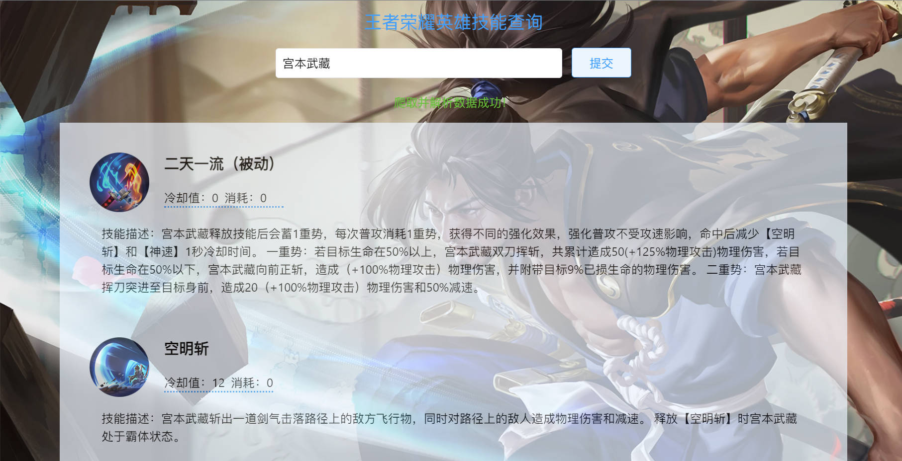

# 使用 Nodejs 爬取王者荣耀英雄技能信息

> 因为没有找到英雄技能信息这方面的接口，尝试用 Node 写写爬虫，从王者荣耀官网（pvp.qq.com）爬取英雄的技能信息。

体验地址: http://wzry.mphy.top （仅供演示作用）

总体思路：通过 express 启动一个服务，使用 superagent 爬取官网数据，得到 html 后使用 cheerio 进行解析，处理后得到技能信息数据，返回给 express 启动的服务，从而得到一个数据接口。



## 技术栈

- 爬虫
  - [superagent](https://www.npmjs.com/package/superagent)：模拟网页请求
  - [superagent-charset](https://www.npmjs.com/package/superagent-charset)： 适配 gbk 网页
  - [cheerio](https://cheerio.js.org/)：解析 html
- 后端：[express](http://expressjs.com)
- 前端：
  - [nashi](https://nashi.js.org)：类似 jQ 但比 jQ 简单轻量很多的 js 库
  - [Twind](https://twind.dev/): 在 js 中写 tailwind 的方案
  - [modern-css-reset](https://github.com/Andy-set-studio/modern-css-reset)：样式重置

## 数据来源

### 网页爬取地址（URI）

- `https://pvp.qq.com/web201605/herodetail/${heroId}.shtml`：`heroId`：爬取此界面的信息，获取英雄的技能描述，heroId 为英雄的 ID（例如赵云为 107）
- `http://game.gtimg.cn/images/yxzj/img201606/skin/hero-info/${heroId}/${heroId}-bigskin-1.jpg`：获取英雄的壁纸（大图），heroId 为英雄的 ID（例如赵云为 107）

### 数据接口（后端路由）

后端路由信息位于 `src/routes` 中。

- `/hero?cname=${cname}`：根据英雄名称获取 heroId，`cname` 为英雄中文名称
- `/skill?heroId=${heroId}`：根据 heroId，和前面的爬取地址拼接为完整的该英雄的页面，然后进行数据爬取，最后解析得到的 html，处理得到 json 数据，供接口服务。

## 开发

### 下载

```
git clone git@github.com:Hacker-C/wzry-skill-spider.git wzry
cd wzry
yarn instal
```

### 启动

```
yarn dev
# 或者
node ./src/app
# Your App is running at http://localhost:3000
```

更推荐使用 nodemon 方式（支持热更新）：
```
npm install -g nodemon
nodemon src/app
```

> 如果爬取遇到网页爬取超时错误，尝试切换网络修改本机 IP 地址。

### 部署

在你的服务器上：

```
pm2 start src/app
# serving at: http://localhost:3000
```

然后使用 nginx 反代：
```conf
server {
    listen 80;
    server_name wzry.mphy.top;
    location / {
        proxy_pass http://localhost:3000;
    }
}
```

给你的域名添加一条 DNS 映射到你的公网 IP 地址，即可访问：http://wzry.mphy.top